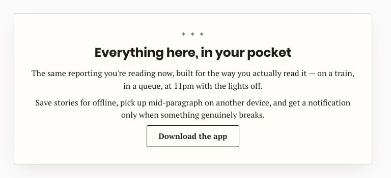
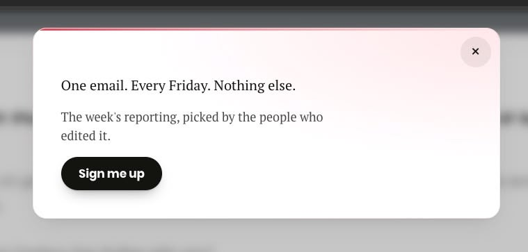

# Whimsical Promo

Editor-managed promo cards — newsletter sign-ups, app pitches, any CTA — rendered
after the post body, at a theme hook of your choosing, or on desktop exit intent.
Copy, design and targeting all live in the block editor, so changes ship without a
deployment.

Activate per site from the Plugins screen. Deactivating is the kill switch: no
promo markup, no assets.

## What it looks like

Both of these are the same plugin, authored entirely in the block editor — the copy,
the button and the design are editor settings, not code.



_Inline placement: the card renders at a theme hook inside the post, in the content
column. A paragraph holding only a link becomes the button._



_Exit-intent placement with the `slide-down` presentation: it arrives when the cursor
leaves the top of the window on desktop, and closes with the ×. Same authoring, different
placement and style._

## Installation

The plugin lives at [github.com/xwp/whimsical-promo](https://github.com/xwp/whimsical-promo)
and installs with Composer. From the site repo root:

```bash
composer config repositories.whimsical-promo vcs https://github.com/xwp/whimsical-promo
composer require xwp/whimsical-promo:dev-main
```

`composer/installers` reads the repo's `installer-paths` and drops it in the plugins
directory — `plugins/whimsical-promo/` in the VIP Go mirror. There is no build step, so
nothing needs compiling afterwards.

Without Composer, clone the repo into `wp-content/plugins/whimsical-promo/`.

Requires PHP 8.1+.

## How a promo works

1. Create **Promos → Add New**. The title is for the admin list only; the body is
   the card content, edited with regular blocks.
2. Fill in **Promo Settings** (below the editor).
3. Publish. Drafts, pending and scheduled promos never render.

Promos on the same hook form a **chain**, ordered by the **Order** field
(Page Attributes). The first promo the visitor has not already interacted with
wins; the rest stay hidden. So the "already subscribed?" fallback is simply the
next promo in the chain with a higher Order number.

A promo with **Stop showing once the visitor clicks or submits** unticked is
always visible: it wins as soon as the chain reaches it, whatever the cookies say,
and nothing after it can ever show. That is how you build a permanent fallback —
and why it has to be **last** by Order.

Promos on _different_ hooks are not a chain. They are independent slots and all of
them render, which is the usual reason a hand-off appears not to work.

## Promo Settings reference

| Field                                               | What it does                                                                                                                                                                                                                                                                                                                                                                             |
| --------------------------------------------------- | ---------------------------------------------------------------------------------------------------------------------------------------------------------------------------------------------------------------------------------------------------------------------------------------------------------------------------------------------------------------------------------------- |
| **Placement**                                       | `Inline` renders at a theme hook. `Exit intent` renders in the footer and appears when the cursor leaves the top of the window (desktop).                                                                                                                                                                                                                                                |
| **Preview**                                         | The `whim_preview=<slug>` query string for this promo, with a Copy button. Add it to any page the promo appears on to open it on demand (see below).                                                                                                                                                                                                                                     |
| **Hook name**                                       | `whim_after_content` — the default — appends the promo to the post body, so a fresh install needs no theme work. Otherwise any action hook your theme fires inside the post. Suggestions come from the `whimsical_promo_hooks` filter and a new promo starts on the first one, so a theme that filters its own hooks to the front sets the default. A few hooks are refused (see below). |
| **Show on these post types**                        | Public post types the promo may appear on. Nothing checked = never renders.                                                                                                                                                                                                                                                                                                              |
| **Stop showing once the visitor clicks or submits** | Sets a `whim_seen_<slug>` cookie, which hands off to the next promo in the chain on later visits. Inline promos set it on click or submit; exit-intent promos set it as soon as they open (see below). Unchecked = shows every visit, never hands off.                                                                                                                                   |
| **Remember for (days)**                             | How long an interaction is remembered, counted from it. Only shown while the box above is ticked; emptying it or setting 0 unticks that box, which is how a promo becomes always-visible. Default 30.                                                                                                                                                                                    |
| **Exit-intent presentation**                        | `slide-down`, `slide-up` or `modal` (only `modal` dims the page). Exit intent only.                                                                                                                                                                                                                                                                                                      |
| **Animation**                                       | `slide-up-spring`, `slide-down-spring`, `fade-rise` or `none`. The spring pair differ only in which way the card travels — pick the one that matches the edge it enters from. Readers who ask for reduced motion always get a plain crossfade.                                                                                                                                           |
| **Style**                                           | The design this promo ships with (see below). Defaults to `basic-1`.                                                                                                                                                                                                                                                                                                                     |
| **Custom CSS**                                      | This promo's CSS, replacing the style's own. Administrators only. Empty means the selected style ships as designed.                                                                                                                                                                                                                                                                      |
| **Colour and shape overrides**                      | Any CSS value per token — hex, `rgba()`, `var(--your-token)`, gradients. These land in the wrapper's `style` attribute, so they beat both the style and Custom CSS.                                                                                                                                                                                                                      |

Override values containing `;`, `{`, `}`, `<`, `>`, `@`, `\`, `url(`,
`expression(`, a comment marker, a control character, or more than 200 bytes are
rejected on save: an admin notice names the fields, and the previous value is kept.

### Hooks that are refused

`wp_head`, `wp_footer`, `template_redirect`, `wp_enqueue_scripts`, `the_content`,
`the_title` and `the_excerpt` are cleared on save, and dropped from the suggestion list
even if a theme adds them. Each one breaks the page rather than the promo: `wp_head` puts
a card in `<head>`, `wp_footer` is where the exit-intent chain already renders, the two
early actions print before the document opens, and the three filters print above the value
they filter rather than after it. Use `whim_after_content` instead of `the_content`.

Every other name is allowed, including one your theme has not fired yet. A hook that never
fires renders nothing, and a name that turns out to be a filter is handed its value back
untouched — so a typo can cost you the promo, never the page.

### Writing a promo body

The stylesheet designs plain editor markup, so you rarely need custom classes:

| You write                             | You get                                                                         |
| ------------------------------------- | ------------------------------------------------------------------------------- |
| A heading                             | Display type, tight leading, balanced line breaks.                              |
| A first paragraph with no heading     | Treated as the lead, one step up in size.                                       |
| Later paragraphs                      | Supporting copy, one step back in contrast.                                     |
| A paragraph holding **only a link**   | The style's button. Add `whim-link` to that link to keep it looking as text.    |
| A **Buttons** block                   | The same button.                                                                |
| A link inside a sentence              | An accent-underlined text link, never a button.                                 |
| A link with class `whim-btn--google`  | The "Add as a preferred source on Google" chip — white, with the multicolour G. |
| A link wrapping **only an image**     | Your artwork on a white backing plate, no button chrome.                        |
| A list                                | Accent star markers.                                                            |
| A shortcode form (`input` + `button`) | Styled field and matching button; stacks on narrow cards.                       |

`whim-cta` on any element opts it into the button treatment. The Google chip's G
is an inline `data:` URI, so it needs no external request and passes CSP.

The standalone-link rule is applied in PHP, not CSS: `Render::promote_cta_links()`
adds `whim-cta` to a link whose paragraph says nothing else. CSS can't tell that
case from a link inside a sentence — `p > a:only-child` matches both, because text
nodes don't count as children.

Blank lines can't be used as spacers. A trailing empty paragraph or a stray
`&nbsp;` is stripped before the body renders, because the card spaces its children
itself and an empty paragraph would read as a hole. Space a card with its style,
not with its content.

### Previewing a promo

Append `whim_preview=<slug>` to any URL the promo renders on. The slug is on the
promo screen under **Preview**, with a Copy button, so nobody has to guess it:

    https://example.com/some-article/?whim_preview=exit-modal

`whim_preview=1` (or `=all`) previews the first promo of every chain on the page,
rather than one named promo.

The promo has to be **published** — drafts and scheduled promos are never placed,
so there would be nothing on the page for the link to open. The **Preview** field
says so instead of offering a link that does nothing.

A preview:

- **ignores the `whim_seen_` cookie**, so a promo already spent for that visitor
  still shows;
- **writes no cookie and reports no analytics**, so it is repeatable, it cannot
  use up the promo for whoever opens the link, and it never shows up as an
  impression or a click in GA;
- **wins its chain outright** when named by slug, so the third promo in a chain
  can be reviewed without spending the first two.

For **exit intent** it also skips the cursor gesture, the five-second dwell and
the `(hover: hover) and (pointer: fine)` check — so the modal and the bars can be
reviewed instantly, and on a phone, where exit intent does not otherwise exist.

**Inline** promos deliberately keep their scroll-triggered entrance: the animation
is the thing worth looking at, so preview only lifts the cookie gate. Scroll to
the hook as normal.

The parameter is read from `location.search` in JavaScript, never from PHP. The
HTML is byte-identical with and without it, so page caches are untouched and a
preview link cannot poison a cached page.

It is **not capability-gated** — a preview link works for anyone, which is what
makes it shareable with a client who has no login. It reveals nothing that is not
already published, and it writes nothing. To restrict it, drop the
`previewTarget` lookup in `assets/promo.js` behind a value emitted from PHP for
logged-in users only.

### Styles

| Style              | Reads as                                                                                                                      |
| ------------------ | ----------------------------------------------------------------------------------------------------------------------------- |
| `basic-1`          | Clean. White card, red accent hairline along the top, ink pill, serif copy. The default.                                      |
| `editorial-insert` | The paper's own furniture. Warm stock, hairline border, a print asterism that settles a beat late, a sonar ping on yes.       |
| `prime-time`       | Broadcast lower-third. Gradient surface, glass ring, an "on-air" light bar that warms up along the edge, a lens bloom on yes. |

Each style is one file under `assets/styles/`. It owns the whole look —
typography, buttons, forms, entrances, the click micro-interaction.
`assets/promo-base.css` declares the `container-type`, and only `basic-1` uses
`@container` against it; the others size on the viewport.

#### The three layers

Weakest to strongest:

1. **`assets/promo-base.css`** — the shape of the box, and nothing else. Where a
   promo sits, how it reveals and dismisses, the close button's 44×44 hit area,
   a fallback focus ring. No colour, no type, no radius.
2. **The style's CSS**, served as its own stylesheet and scoped to
   `#whim-promo-<id>` (the `ID` placeholder resolved to this promo).
3. **Colour and shape overrides**, in the wrapper's `style` attribute.

Layer 2 is an id selector (1-0-0), so it outranks the base (0-2-0 at most)
_by construction_. That is the point of the split: a style never needs
`!important`, and the base never has to mirror a style's specificity.

#### How the CSS is delivered

A promo's CSS is a pure function of its post meta, so it is the same for every
visitor and can be cached hard. Each promo gets its own stylesheet at
`/?whim_promo_css=<id>&whim_ver=<hash>`, sent with
`Cache-Control: public, max-age=31536000, immutable`. The hash is a fingerprint of
the CSS itself, so saving a promo changes the URL and nothing has to be purged.
VIP's edge honours an application's own `Cache-Control` rather than replacing it,
which is what makes the long TTL real.

Three things follow from that:

- **Bundled templates are minified on the way out** — comments and slack removed,
  which roughly halves the compressed weight. Author-written Custom CSS is passed
  through untouched: stripping comments with a regex would corrupt any string
  holding `*/`, and there is no corpus to test that against.
- **Promo stylesheets do not block the first paint.** They load as
  `media="print"` and swap to `all` on load, with a `<noscript>` fallback. A promo
  is below the fold and stays hidden until the script reveals it, so its design is
  never needed for the initial render.
- **Exit-intent CSS is not loaded with the page at all.** The wrapper carries the
  URL in `data-whim-css`, and the script fetches it only once the promo is armed —
  which never happens if the suppression cookie is already set, or on a touch
  device. Reveal waits for the sheet, with a timeout so a slow or blocked
  stylesheet shows the promo plainly rather than not at all.

A deliberate trade: two promos sharing a template produce two nearly identical
stylesheets, which compress better as one inline block than as two responses. The
separate responses cost slightly more on a first page view and less on every page
after it, because they are then reused across the site rather than re-sent with
every HTML response. Neither is free; this favours the reader who reads more than
one article.

A rewrite rule was avoided on purpose. A rewrite needs a flush to exist, and a
missed flush would turn every promo stylesheet into a 404 that the edge then
caches. A query argument works the moment the plugin is active.

#### Custom CSS

Picking a style and saving nothing else is a complete choice — the template
renders as designed. Fill in **Custom CSS** and it replaces the template
entirely; **Load the selected style into the editor** copies the template in as a
starting point, with a bare `#whim-promo` resolved to this promo's id. A template
written with the `ID` placeholder loads with the placeholder intact, and keyframe
names are left as written either way — both are rewritten on output, so what you
read in the field is not byte-for-byte what ships.

So a new design can be generated elsewhere — Claude Design, an agent, by hand —
and pasted in without a deploy. Four rules for anything pasted:

- **Scope every selector to `#whim-promo-ID`.** `ID` is a literal placeholder,
  replaced with the promo's own post id on output — so one stylesheet can be pasted
  into any promo and scopes itself, and nothing has to be hand-edited when it moves.
  A concrete `#whim-promo-412`, or a bare `#whim-promo`, is accepted and rewritten
  the same way.
- **Name animations `whim-kf-ID-something`.** The same placeholder, rewritten the
  same way, so two promos can carry different edits of the same animation without
  one silently overwriting the other. `@keyframes` names are global otherwise.
- **Wrap entry offsets in `:where()`.** `#whim-promo:where(.whim-promo--slide-down)
.whim-promo__card` scores 1-1-0, so the `#whim-promo.is-revealed .whim-promo__card`
  reset at 1-2-0 always wins and the card settles. Written flat the two tie, source
  order decides, and a card that entered from off-screen stays there — visibly
  nothing rendered. Presentation offsets go after preset offsets so a bar still
  overrides the preset's shorter hop.
- **Don't expect to add markup.** The wrapper / backdrop / card / close / body
  skeleton is fixed in PHP because the reveal, the dismiss and the ARIA
  attributes depend on it. Ornament goes on `::before` / `::after`, artwork goes
  in as a `data:` URI. All three bundled designs work that way.

#### Nothing escapes the promo

The first rule is enforced, not just documented. Every top-level selector is
confined to the promo's wrapper on the way out, so `p { font-weight: bold }` is
served as `#whim-promo-412 p { font-weight: bold }` and styles paragraphs in the
card rather than every paragraph on the page. A pasted stylesheet cannot reach the
article, the header or another promo, however it is written.

Each comma-separated part is confined independently — `h1, .sidebar` becomes two
scoped selectors, not one scoped and one loose. Confining recurses into `@media`,
`@supports`, `@container`, `@layer`, `@scope` and `@starting-style`, and leaves
`@keyframes` alone, because `from` and `50%` are offsets rather than elements. A
selector already starting at this promo's id is left exactly as written, which
includes every rule in every bundled template — the pass is a byte-for-byte no-op
on all three, and a test asserts that so a future template can't quietly ship a
global rule.

Two things it does not do. `@font-face` and `@property` register globally because
they have no selector to confine, and `url()` can still point at a third-party
host. The `manage_options` gate below is the real boundary: this closes the
accident, not a hostile administrator.

#### Designing with an AI agent

**Create more designs using AI agents?** on the promo screen holds a
copy-and-paste brief for exactly that. It carries everything an agent needs
without access to this repository, written in the `#whim-promo-ID` placeholder form
so the result can be pasted into any promo: the markup skeleton it may not change,
the placement / presentation / preset classes an editor can pick, the state
classes, the `--whim-*` tokens the override fields write, the rules above, how
`.is-revealed` and `.is-lit` are timed, and the promo's current style in full as a
worked example.

The agent returns two blocks — an HTML sample body for the editor and one
stylesheet for Custom CSS. Nothing is transmitted from the promo screen; copying
is manual. `Agent_Brief::text()` builds it, and its tests assert the brief keeps
naming every choice an editor can actually make, so adding a preset or a token
without mentioning it in the brief fails the suite.

CSS pasted into a **Custom HTML block** in the promo body will _not_ work:
`wp_kses_allowed_html( 'post' )` has no `style` element, so it is stripped
silently. That is what this field is for.

The field is gated on `manage_options` (filter: `whimsical_promo_can_edit_css`),
for the same reason core gates Additional CSS — `url()` in CSS can reach a
third-party host. `</` is stripped on save _and_ on output so nothing can escape
the `<style>` element, and `@import` is dropped as a render-blocking remote
fetch. A bare `<` survives, because range syntax needs it.

#### Tokens

The **Colour and shape overrides** fields write six tokens — `--whim-bg`,
`--whim-accent`, `--whim-border`, `--whim-text`, `--whim-shadow`, `--whim-radius`
— so a recolour works without touching CSS. All three styles also read
`--whim-padding`, `--whim-max-width`, `--whim-duration` and `--whim-ease`, which
are reachable from Custom CSS.

Not every style reads every token. `editorial-insert` has no accent colour in its
design and ignores `--whim-accent` entirely, so the **Accent** field looks broken
on it — it isn't, there is simply nothing there to tint.

Everything else is a style's own business, and the names differ between them on
purpose. One trap carried over from the token layer: change **Background** to
something dark and the style's dark body copy stays dark. Change **Text color**
in the same edit.

#### Adding a style

A theme registers one through `whimsical_promo_styles`:

```php
add_filter( 'whimsical_promo_styles', function ( $styles ) {
	$styles['house-style'] = [
		'label' => 'House style',
		'file'  => get_stylesheet_directory() . '/promo-styles/house-style.css',
	];
	return $styles;
} );
```

The slug becomes a CSS class and a data attribute, so it is limited to
`[a-z0-9-]`. `assets/styles/basic-1.css` documents the contract in full and is the
file to copy from. A style with a malformed slug or a missing file is dropped, and
if a filter leaves nothing valid the bundled set comes back.

The bundled templates predate the placeholder and are written against a bare
`#whim-promo` with `whim-kf-` names. Both forms scope identically, so they were
left alone — but write new ones as `#whim-promo-ID` and `whim-kf-ID-…`, which show
the substitution instead of hiding it.

#### On the wrapper

```html
<div
	id="whim-promo-412"
	class="whim-promo whim-promo--inline-hook
  whim-promo--preset-slide-up-spring whim-promo--style-prime-time"
	data-whim-style="prime-time"
	…
></div>
```

The id is what CSS hangs off. `data-whim-style` and `whim-promo--style-<slug>` are
there for theme-side and analytics selectors.

## Behaviour details worth knowing

- **No layout shift.** The slot has zero height until a promo wins. If every promo
  in a chain is spent, nothing expands and there is no gap.
- **The reveal is in three beats.** The winning promo claims its full height as
  soon as the script runs, so the article never shifts later. It stays invisible
  until it is about 12% into the viewport, then animates in. Its accent detail —
  the on-air bar, the asterism — lights separately as the card crosses the middle
  of the screen (`is-lit`; `editorial-insert` and `prime-time` use it, `basic-1`
  has no such detail). The `view` event fires with the entrance, not on page load,
  so impressions match what readers actually saw.
- **Exit intent needs a real pointer.** Bound only when
  `(hover: hover) and (pointer: fine)` matches, after 5 seconds on the page, once
  per page load. Closable with the × button or Esc; focus returns to wherever it
  was afterward. A modal traps Tab inside the dialog while it is open; bars and
  slide-ins do not. Modals are layered above the theme's bottom adhesion ad so
  the backdrop is never punctured.
- **A modal opens focused on the dialog itself**, not on × and not on a control.
  Nothing is armed the instant it appears, and the first Tab reaches the promo's
  own call to action — × is last in the card, so Tab never offers it first. Only
  modals move focus; bars and slide-ins deliberately leave the reader where they
  were.
- **Exit-intent cookies are set on open, not on click.** An overlay that a reader
  saw and closed has been spent — it does not reappear on the next visit, and the
  chain hands off to the next promo instead. Inline promos are the opposite: they
  only spend their cookie when the reader actually clicks or submits.
- **Cache-safe by construction.** The HTML for a URL is byte-identical for every
  visitor: no `wp_is_mobile()`, no UA sniffing, no cookie reads on the server.
  Every per-visitor decision happens in `promo.js`.
- **Cookies disabled?** The promo simply shows again next visit.
- **JS disabled?** Promos stay hidden. Nothing breaks.
- **Body rendering** is `do_blocks()` → `wpautop()` → `wp_kses()` → `do_shortcode()`, not the
  `the_content` filter — so ad injection and related-post filters can't land
  inside a promo card. Authored `<form>`/`<script>` is stripped; markup emitted by
  a shortcode (a newsletter form, say) is not. Widen the allowlist with
  `whimsical_promo_kses_allowlist` if you need raw form markup in the body.
  Note that blocks which enqueue their own assets may render after the enqueue
  window; prefer static blocks and shortcodes in promo bodies.

## Tracking

**Promos → Settings** holds the plugin-level tracking config: an on/off toggle and
a delivery mode — push to `dataLayer` (Google Tag Manager) or call `gtag()`
directly. With tracking off, promos work exactly as before and emit nothing.

Every interaction emits one event, `whimsical_promo`:

```js
window.dataLayer.push({
	event: "whimsical_promo",
	promo_id: "newsletter-inline", // the promo post slug
	promo_placement: "inline_hook", // inline_hook | exit_intent
	promo_action: "view", // view | click | submit | dismiss
	promo_target: "/subscribe/", // link href or form id, on click/submit
});
```

In `gtag` mode the same payload goes to
`gtag( 'event', 'whimsical_promo', { … } )`, and is skipped silently when no
`gtag` function exists. Consent gating stays where it belongs — in GTM.

### Google Tag Manager

1. **Variables → New → Data Layer Variable**, once per field: `promo_id`,
   `promo_placement`, `promo_action`, `promo_target`.
2. **Triggers → New → Custom Event**, event name `whimsical_promo`, fire on all
   custom events.
3. **Tags → New → Google Analytics: GA4 Event**. Event name `whimsical_promo`;
   add the four variables as event parameters using the same names.
4. Attach the trigger, use **Preview** to confirm the event and parameters arrive,
   then **Submit**.

### GA4

1. **Admin → Custom definitions → Create custom dimension**, scope _Event_, one
   per parameter: `promo_id`, `promo_placement`, `promo_action`, `promo_target`.
2. Custom dimensions only populate from their creation date onward.
3. **Admin → Events**: mark `whimsical_promo` as a key event if promo submissions
   count as conversions for you.
4. Verify in **DebugView** (direct `gtag` mode) or GTM **Preview** (`dataLayer`
   mode).

The settings page carries the same instructions, so editors and analytics owners
don't need this file.

## Filters

| Filter                           | Signature                           | Use                                                                                                           |
| -------------------------------- | ----------------------------------- | ------------------------------------------------------------------------------------------------------------- |
| `whimsical_promo_hooks`          | `array $hooks`                      | Hook names suggested in the editor's datalist; the first is a new promo's default. Refused hooks are dropped. |
| `whimsical_promo_should_render`  | `bool $should, WP_Post $promo`      | Final per-promo veto on the current request.                                                                  |
| `whimsical_promo_kses_allowlist` | `array $allowlist, WP_Post $promo`  | Widen or narrow what promo bodies may contain.                                                                |
| `whimsical_promo_wrapper_class`  | `string[] $classes, WP_Post $promo` | Add theme classes to the promo wrapper.                                                                       |
| `whimsical_promo_styles`         | `array $styles`                     | Register a style. First entry is the default.                                                                 |
| `whimsical_promo_can_edit_css`   | `bool $can_edit`                    | Who may write a promo's raw CSS.                                                                              |

## Tests

PHP is covered by PHPUnit. The suite needs a WordPress test environment, so
`WP_PHPUNIT__DIR` has to point at [`wp-phpunit`](https://github.com/wp-phpunit/wp-phpunit)
— the site repo hosting the plugin normally provides it:

```bash
phpunit --configuration=phpunit.xml.dist
```

`promo.js` has no unit harness — the plugin has no build step — so it is covered in a
real browser instead, by Playwright specs that live with the host site's suite and are
tagged `@promo`.

They run against `tests/fixtures/promo-chain.html`, a static page shipped with the plugin
that loads `promo.js` straight from the plugin path with a cache-buster generated at
runtime. It needs no database, no promo posts and no seeding, so the same tests work on
any environment. They cover chain selection, the scroll entrance and its `view` event,
click → cookie → hand-off, a preview writing neither cookie nor analytics, and the
malformed-cookie regression.

The fixture is a hand-written copy of the skeleton `Render` emits, so it can drift.
`tests/test-class-fixture-markup.php` is the guard: it fails when an attribute or
structural class in the fixture is no longer rendered. Update the fixture and that test
together whenever the wrapper markup changes.
